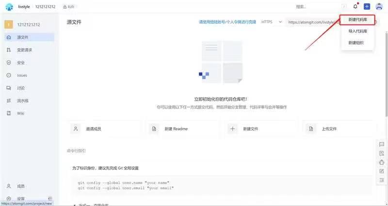
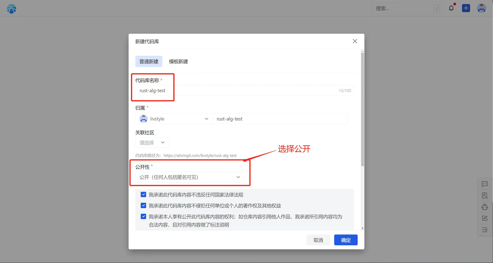
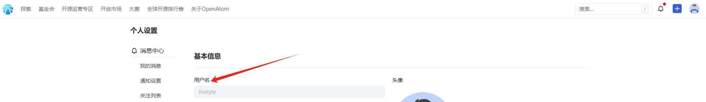
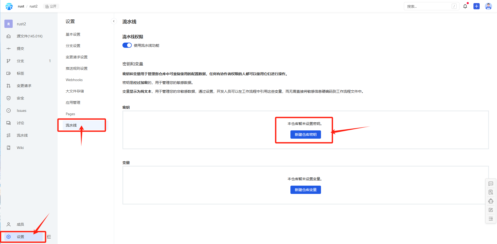
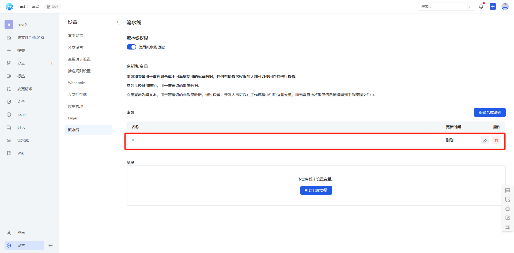
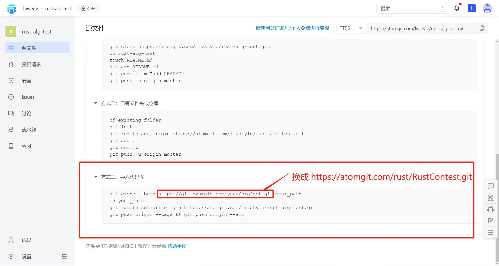

## Rust Contest
> Rust 数据结构与算法大赛作品提交仓库 

1. 在开放原子注册账号 地址是 https://passport.atomgit.com/login
2. 创建一个空的开源项目
    
3. 设置为私有源 [下图标识是公开，你不需要公开了]
    
<!-- 4. 配置流水线密钥变量信息 名称是ID 值为在atomgit的用户名
5. 在个人设置中查找用户名
    
6. 配置密钥说明图
    
7. 配置成功会这样显示
     -->
4. 从https://atomgit.com/rust/RustContest.git导入题目
    
5. 开启流水线功能
6. 在https://opencamp.cn/atomgit/camp/rust/stage/2报名并完善个人信息；AtomgitName 必填且是填写Atomgit的用户名

## 代码提交
* 初赛 完成 exercises 目录下5道题
* 复赛 完成 topic1 目录下11道题
* 决赛 待定

完成作业后将代码 push 到自己创建的项目的 master 分支即可

## 运行条件
> 该项目所必须的条件和相关依赖  
* Linux，推荐Ubuntu20.04及以上版本，当然，centos 等linux发行版也是可以的。
* 代码必须使用Rust实现，不准使用AI编程，所有代码都会评审，且检测是否AI编码。只使用Rust自带库，和部分基础库，如序列化库、数学库等。

## 运行说明
> 运行具体步骤说明
* 进入代码目录里的项目
* 通过Cargo能编译成功
* 编译得到的二进制能运行
