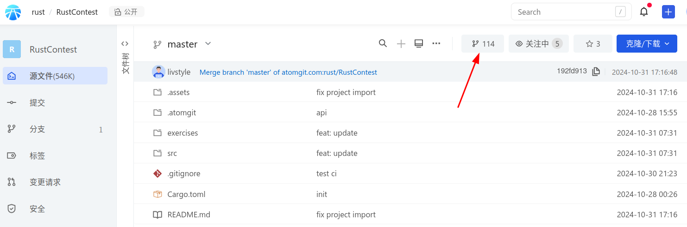

## Rust Contest
> Rust 数据结构与算法大赛作品提交仓库 

1. 在开放原子注册账号 地址是 https://passport.atomgit.com/login
2. 从 https://atomgit.com/rust/RustContest fork 项目
   

## 代码提交
完成作业后将代码push到自己创建的项目的master分支即可

## 运行条件
> 该项目所必须的条件和相关依赖  
* Linux，推荐Ubuntu20.04及以上版本，当然，centos 等linux发行版也是可以的。
* 代码必须使用Rust实现，可以依赖外部命令行工具、或库，但主体逻辑必须是Rust实现。

## 运行说明
> 运行具体步骤说明
* 进入exercises目录里面的项目
* 通过Cargo能编译成功
* 编译得到的二进制能运行
